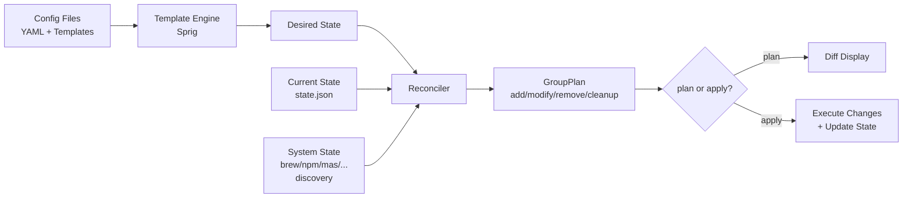
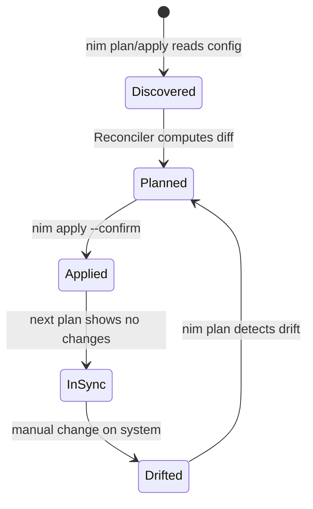
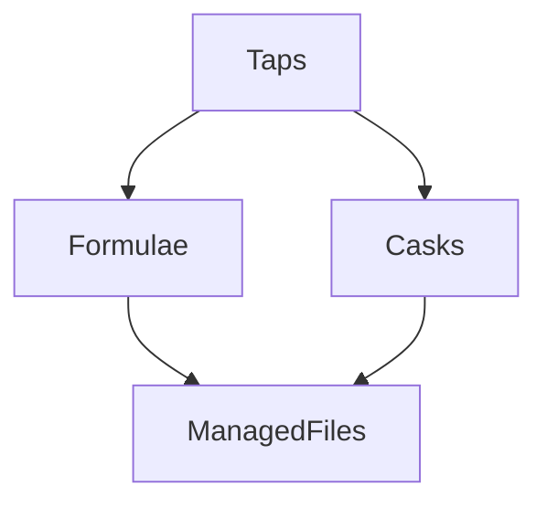

# Architecture

Nim brings Terraform-inspired plan/apply workflows to dotfiles and package management.

## High-level flow



## Resource lifecycle



## Component architecture

```mermaid
flowchart TB
    subgraph CLI
        cmd[cmd/root.go<br>cmd/plan.go<br>cmd/apply.go<br>cmd/state.go]
    end

    subgraph Engine["pkg/engine"]
        engine[Engine]
        graph[Dependency Graph<br>pkg/graph]
        stats[Stats]
    end

    subgraph Providers["pkg/providers"]
        brew[BrewProvider]
        npm[NpmProvider]
        go[GoProvider]
        cargo[CargoProvider]
        file[FileProvider]
        aiskill[AISkillProvider]
        appstore[AppStoreProvider]
    end

    subgraph Resources["pkg/resource"]
        res[Resource Types<br>YAML → structs]
        loader[Loader<br>filesystem → resources]
    end

    subgraph State["pkg/state"]
        local[LocalBackend<br>state.json]
        s3[S3Backend]
    end

    cmd --> engine
    engine --> Providers
    engine --> Resources
    engine --> State
    Providers --> State
```

## State backends

| Backend | Implementation | Config |
|---------|---------------|--------|
| Local JSON | `pkg/state/local.go` | `state.backend: local` |
| S3-compatible | `pkg/state/s3.go` | `state.backend: s3` with endpoint, bucket, key, region |

## Provider interface

Every provider implements:

```go
type Provider interface {
    Name() string
    Available() (bool, string)
    Reconcile(ctx, desired, state) GroupPlan
    Apply(ctx, GroupPlan) ([]ApplyItemResult, error)
}
```

Optional extensions:
- `CoverageProvider` — reports installed items (`InstalledForKind`)
- `Importer` — discovers existing state (`Import`)

## Dependency graph

Resources can declare `dependsOn` in metadata. Nim builds a DAG and applies in topological order:

```yaml
metadata:
  name: my-app
  dependsOn:
    - HomeBrewPackages/core-tools
```

